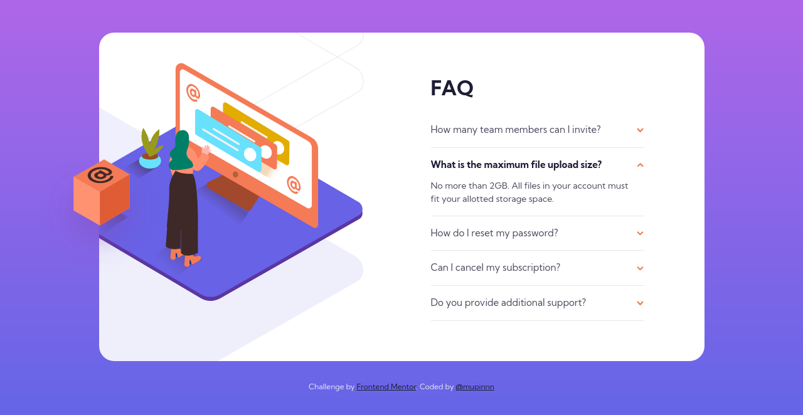

# Frontend Mentor - FAQ Accordion Card Solution

This is a solution to the ["FAQ Accordion Card" challenge on Frontend Mentor](https://www.frontendmentor.io/challenges/profile-card-component-cfArpWshJ). Frontend Mentor challenges help you improve your coding skills by building realistic projects.

## Table of contents

<!--
  Table of contents will be generated automatically on build-time based
  on this document heading(s) using `remark-toc`
-->

## Overview

### The challenge

Accordion is most common pattern in front-end, so it's super great to build it from scratch.

Users should be able to:

- View the optimal layout depending on their device's screen size
- See hover states for all interactive elements on the page
- Hide/show the answer to a question when the question is clicked

### Screenshot

### Links

- [Live Site URL](https://mupinnn.github.io/slices/faq-accordion-card)

## My process

### Built with

- Pug
- SCSS + `modern-normalize`
- Flexbox
- Mobile-first approach
- Webpack v5

### What I learned

I utilizing `
` and `
` element to create the accordion/disclosure. Its
the standar/semantic so doesn't need to use `
`. The fun part is for I've done it without
JavaScript to open/close each of the faq answers.

### Continued development

Still, day-to-day I'll keep drilling to use better class naming, structure, etc.

### Useful resources

- [The `
` element docs](https://developer.mozilla.org/en-US/docs/Web/HTML/Element/details)

## Author

- [Website](https://mupinnn.github.io)
- GitHub - [@mupinnn](https://github.com/mupinnn)
- Frontend Mentor - [@mupinnn](https://www.frontendmentor.io/profile/mupinnn)
- Twitter - [@itsmupinnn](https://www.twitter.com/itsmupinnn)
