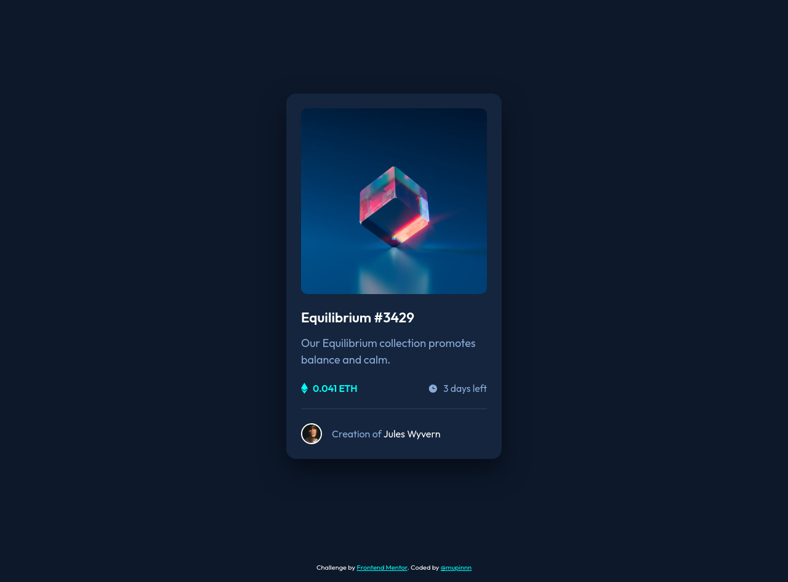

# Frontend Mentor - NFT Preview Card Component Solution

This is a solution to the ["NFT Preview Card Component" challenge on Frontend Mentor](https://www.frontendmentor.io/challenges/nft-preview-card-component-SbdUL_w0U). Frontend Mentor challenges help you improve your coding skills by building realistic projects.

## Table of contents

- [Overview](#overview)
  - [The challenge](#the-challenge)
  - [Screenshot](#screenshot)
  - [Links](#links)
- [My process](#my-process)
  - [Built with](#built-with)
  - [What I learned](#what-i-learned)
  - [Continued development](#continued-development)
  - [Useful resources](#useful-resources)
- [Author](#author)

## Overview

### The challenge

Users should be able to:

- View the optimal layout depending on their device's screen size
- See hover states for interactive elements

### Screenshot

### Links

- Solution URL: -
- [Live Site URL](https://mupinnn.github.io/slices/nft-preview-card)

## My process

### Built with

- Pug
- SCSS + `modern-normalize`
- Flexbox
- Mobile-first approach
- Webpack v5

### What I learned

Inlining SVG has more advantage than use it as ``; especially
for icon(s).

### Continued development

I'll keep exploring to get a grasp for better class naming, structure, etc.

### Useful resources

- [SO Discussion](https://stackoverflow.com/questions/23210126/inline-svg-vs-svg-file-performance) - Inline SVG vs SVG file performance discussion

## Author

- [Website](https://mupinnn.github.io)
- GitHub - [@mupinnn](https://github.com/mupinnn)
- Frontend Mentor - [@mupinnn](https://www.frontendmentor.io/profile/mupinnn)
- Twitter - [@itsmupinnn](https://www.twitter.com/itsmupinnn)
