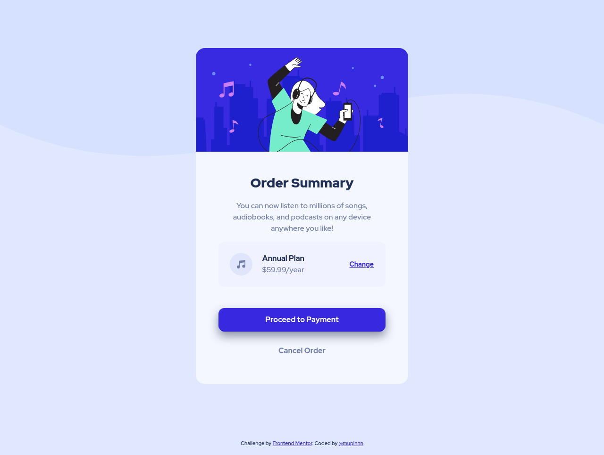

# Frontend Mentor - Order Summary Card Component Solution

This is a solution to the ["Order Summary Card Component" challenge on Frontend Mentor](https://www.frontendmentor.io/challenges/order-summary-component-QlPmajDUj).

## Table of contents

- [Overview](#overview)
  - [The challenge](#the-challenge)
  - [Screenshot](#screenshot)
  - [Links](#links)
- [My process](#my-process)
  - [Built with](#built-with)
  - [What I learned](#what-i-learned)
  - [Continued development](#continued-development)
- [Author](#author)

## Overview

### The challenge

Users should be able to:

- View the optimal layout depending on their device's screen size
- See hover states for interactive elements

### Screenshot

### Links

- Solution URL: -
- [Live Site URL](https://mupinnn.github.io/slices/order-summary-card)

## My process

### Built with

- Pug
- SCSS + `modern-normalize`
- Flexbox
- Mobile-first approach
- Webpack v5

### What I learned

Not so much, I keep training to get the result as close as possible to
the design.

### Continued development

Same as [previous challenge](https://github.com/mupinnn/slices/tree/main/src/pages/nft-preview-card#continued-development).

## Author

- [Website](https://mupinnn.github.io)
- GitHub - [@mupinnn](https://github.com/mupinnn)
- Frontend Mentor - [@mupinnn](https://www.frontendmentor.io/profile/mupinnn)
- Twitter - [@itsmupinnn](https://www.twitter.com/itsmupinnn)
