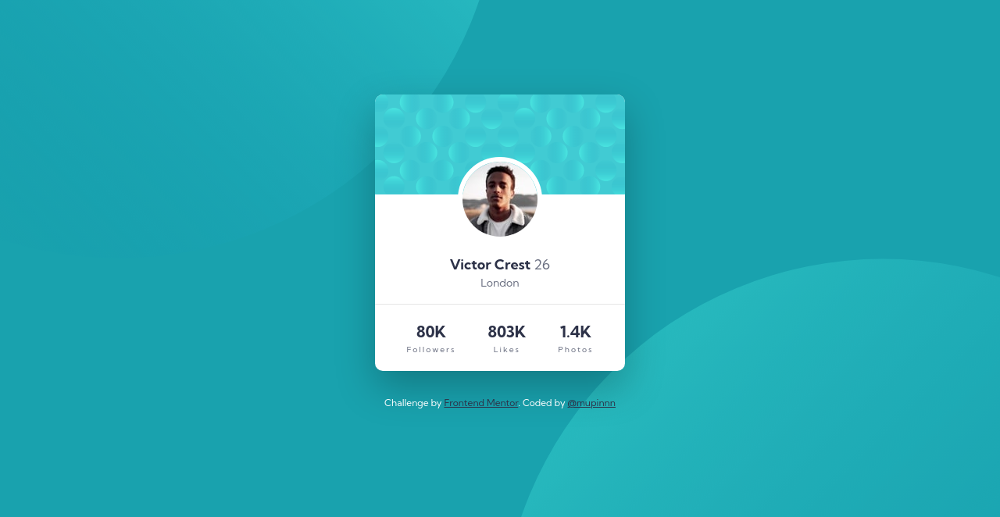

# Frontend Mentor - Profile Card Component Solution

This is a solution to the ["Profile Card Component" challenge on Frontend Mentor](https://www.frontendmentor.io/challenges/profile-card-component-cfArpWshJ). Frontend Mentor challenges help you improve your coding skills by building realistic projects.

## Table of contents

<!--
  Table of contents will be generated automatically on build-time based
  on this document heading(s) using `remark-toc`
-->

## Overview

### The challenge

The card layout doesn't shift, so it's perfect to focus practicing on layouting. The most
challenging part of this challenge is to adjust the background patterns position. I tried
every single solution that I know, like: using `calc()`, percentage and fixed unit (px);
then I'm strolling to other people solution to see how they do it and I found one interesting
approach, is to use `vw` and `vh` unit.

Thanks to [Josip Keresman](https://www.frontendmentor.io/solutions/profile-card-component-challenge-DdoDI-h7K) for the inspiration
to adjust the background position. This is an "AHA" moment for me because I actually
forgot to use the viewport unit. I'm super satisfied with the result because it's
very stable and stick to the place where the background belongs instead using percentage
or fixed unit that made the background shifting on screen resize (need some adjustment on every possible breakpoint).

### Screenshot

### Links

- [Live Site URL](https://mupinnn.github.io/slices/profile-card)

## My process

### Built with

- Pug
- SCSS + `modern-normalize`
- Flexbox
- Mobile-first approach
- Webpack v5

### What I learned

Negative margin is super handy to create overlapping element like this profile card
avatar image.

### Continued development

I'll keep exploring to get a grasp for better class naming, structure, etc.

## Author

- [Website](https://mupinnn.github.io)
- GitHub - [@mupinnn](https://github.com/mupinnn)
- Frontend Mentor - [@mupinnn](https://www.frontendmentor.io/profile/mupinnn)
- Twitter - [@itsmupinnn](https://www.twitter.com/itsmupinnn)

## Acknowledgments

Thanks to [Josip Keresman](https://www.frontendmentor.io/solutions/profile-card-component-challenge-DdoDI-h7K) for the inspiration
to adjust the background position.
