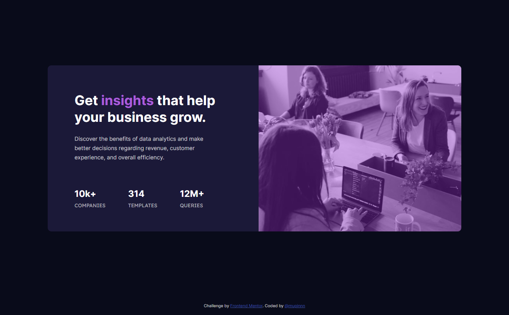

# Frontend Mentor - Stats Preview Card Component Solution

This is a solution to the ["Stats Preview Card Component" challenge on Frontend Mentor](https://www.frontendmentor.io/challenges/stats-preview-card-component-8JqbgoU62). Frontend Mentor challenges help you improve your coding skills by building realistic projects.

## Table of contents

- [Overview](#overview)
  - [The challenge](#the-challenge)
  - [Screenshot](#screenshot)
  - [Links](#links)
- [My process](#my-process)
  - [Built with](#built-with)
  - [What I learned](#what-i-learned)
  - [Continued development](#continued-development)
  - [Useful resources](#useful-resources)
- [Author](#author)

## Overview

### The challenge

Users should be able to:

- View the optimal layout depending on their device's screen size

### Screenshot

### Links

- Solution URL: -
- Live Site URL: -

## My process

### Built with

- Pug
- SCSS + `modern-normalize`
- Flexbox
- Mobile-first approach
- Webpack v5

### What I learned

I discovered easyn and simple way to create image overlay without adding empty element,
usually a `div`; using `::after` pseudo-element selector and fit it with the image
container size.

### Continued development

For future projects, I'm still curious and want to dig dive more about flexbox and grid,
creating asymmetrical layout, etc. BEM, and other methodologies packed to my learning
list too!

### Useful resources

- [SASS Guidelines](https://sass-guidelin.es/#architecture) - I really like the `7-1` pattern
  for organizing my SASS files.

## Author

- [Website](https://mupinnn.github.io)
- GitHub - [@mupinnn](https://github.com/mupinnn)
- Frontend Mentor - [@mupinnn](https://www.frontendmentor.io/profile/mupinnn)
- Twitter - [@itsmupinnn](https://www.twitter.com/itsmupinnn)
